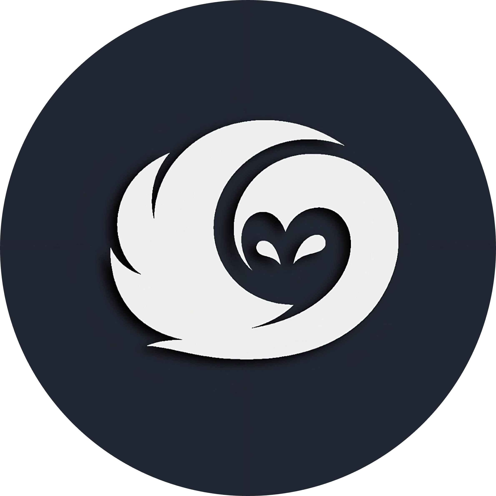

<h1 align="center">Nightwise</h1>

Nightwise is a sleek and efficient to-do app designed as a bachelor's degree project. It's crafted with Vue.js and tailored to showcase the capabilities of various frontend frameworks such as Svelte and Solid.

 

## Features

- **User-friendly Interface**: Nightwise offers an intuitive and clean user interface, making task management a breeze.
- **Task Organization**: Easily organize your tasks with categories, priorities, and due dates.
- **Responsive Design**: Nightwise adapts seamlessly to different screen sizes, ensuring a consistent user experience across devices.
- **Framework Comparison**: The project provides a platform to compare Vue.js with other frontend frameworks like Svelte and Solid, showcasing their strengths and weaknesses in real-world scenarios.

## Installation

1. Clone the repository: `git clone https://github.com/yourusername/nightwise.git`
2. Navigate to the project directory: `cd nightwise`
3. Install dependencies: `npm install`
4. Start the development server: `npm run serve`
5. Open your browser and visit `http://localhost:8080` to view Nightwise in action.

## Usage

1. Create a new task by clicking the "+" button.
2. Enter task details such as title, description, category, priority, and due date.
3. Click "Save" to add the task to your list.
4. Manage your tasks by marking them as complete or deleting them.
5. Explore the app and compare its performance with other frameworks.

## Framework Comparison

Nightwise serves as a playground to evaluate Vue.js alongside other frontend frameworks like Svelte and Solid. Through this project, you can gain insights into each framework's syntax, performance, and development experience. Feel free to experiment, analyze, and draw your conclusions about which framework suits your project requirements best.

## Contributing

We welcome contributions from the community to enhance Nightwise further. Whether it's bug fixes, feature additions, or framework-specific optimizations, your input is valuable. To contribute:

1. Fork the repository.
2. Create a new branch: `git checkout -b feature/new-feature`
3. Make your changes and commit them: `git commit -am 'Add new feature'`
4. Push to the branch: `git push origin feature/new-feature`
5. Submit a pull request.

## License

Nightwise is licensed under the [BSD 3-Clause License](LICENSE).

## Acknowledgements

We extend our gratitude to the Vue.js, Svelte, and Solid communities for their invaluable contributions to frontend development. Special thanks to our mentors and advisors for their guidance throughout the project.

---

Thank you for choosing Nightwise! We hope you find it not only helpful for task management but also insightful in your journey to explore frontend frameworks. If you have any questions, suggestions, or feedback, don't hesitate to reach out. Happy coding! 🚀
