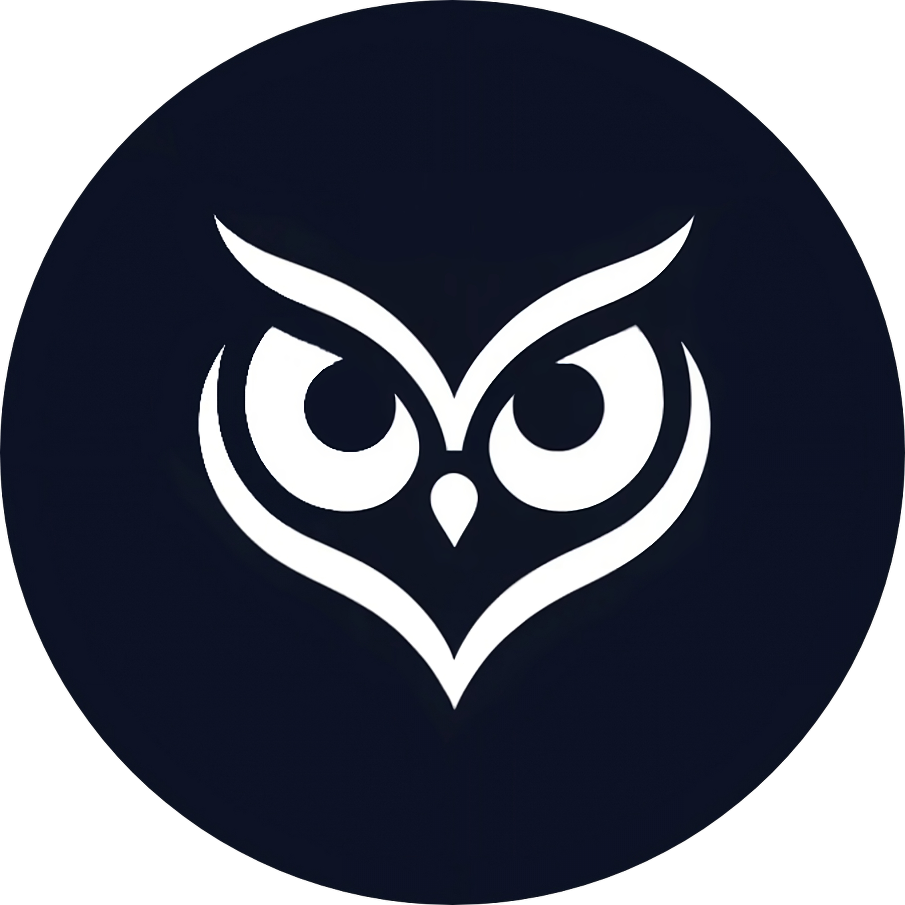

<h1 align="center">Nightwise</h1>

Nightwise is not just a to-do app; it's a comprehensive analysis conducted as part of a bachelor's thesis. This implementation is developed using Vue3 and Pocketbase to evaluate and compare the nuances of different frontend frameworks including Vue.js, Svelte, and Solid.

 

## Project Overview

- **Educational Purpose**: The core objective of Nightwise is to serve as a detailed case study for a bachelor's thesis, focusing on the practical comparison of frontend frameworks.
- **Identical Implementations**: Nightwise is meticulously crafted across three distinct frontend technologies: Vue.js, Svelte, and Solid, each paired with Pocketbase for backend operations.
- **Comparison Methodology**: The project employs a range of methodologies to assess and compare the frameworks, including but not limited to performance benchmarks, developer experience, and syntax ease-of-use.

 ## Features

- **User-friendly Interface**: Nightwise offers an intuitive and clean user interface, making task management a breeze.
- **Task Organization**: Easily organize your tasks with categories, priorities, and due dates.
- **Responsive Design**: Nightwise adapts seamlessly to different screen sizes, ensuring a consistent user experience across devices.

## Installation

1. Clone the repository: `git clone https://github.com/yourusername/nightwise.git`
2. Navigate to the project directory: `cd nightwise`
3. Install dependencies: `npm install`
4. Start the development server: `npm run serve`
5. Open your browser and visit `http://localhost:3000` to explore Nightwise.
   

## Usage

1. Create a new task by clicking the "+" button.
2. Enter task details such as title, description, category, priority, and due date.
3. Click "Create" to add the task to your list.
4. Manage your tasks by marking them as complete or deleting them.
5. Explore the app and compare its performance with other frameworks.

## Framework Comparison

This project offers a unique opportunity to delve into the intricacies of Vue.js, Svelte, and Solid. It's designed to provide hands-on experience and insights into each framework's syntax, performance, and overall development workflow. Engage with Nightwise to inform your choice of technology for future projects.

## License

Nightwise is licensed under the [BSD 3-Clause License](LICENSE).

## Acknowledgements

A heartfelt thank you to the communities behind Vue.js, Svelte, and Solid. Their work and collaboration have made this comparative study possible. Special appreciation goes to the project mentors and advisors for their unwavering support and guidance.

---

I am excited to present Nightwise as a tool for educational and research purposes in the field of web development.
